# Charity Auction — GitOps Pipeline

GitOps pipeline deploying a **Charity Auction** application (Spring Boot + Next.js) onto a self-managed Kubernetes cluster on AWS, automated end-to-end with Jenkins and ArgoCD.

<p align="center">
  
</p>

---

## Architecture Overview

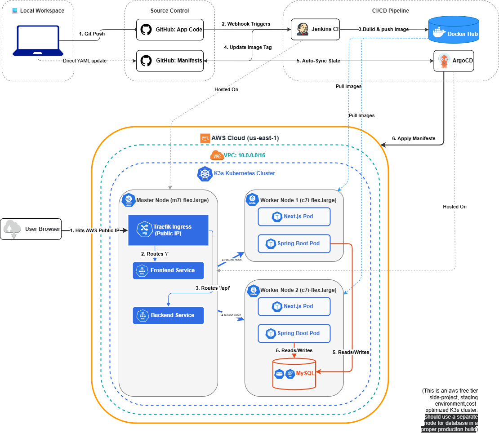

| Repository | Contents |
|---|---|
| `charity-auction-devops` **(Repo A)** | Application source code, Dockerfiles, Jenkinsfile |
| [`charity-auction-gitops-manifests`](https://github.com/tharindudeshapriya/charity-auction-gitops-manifests.git) **(Repo B)** | Kubernetes YAML manifests (auto-updated by Jenkins) |

---

## Project Workflow

This section describes the complete end-to-end lifecycle of the pipeline, from a developer committing code to the application running live on the Kubernetes cluster.

### 1. Infrastructure Provisioning

Before any code is deployed, Terraform provisions the AWS cloud environment. It creates a Virtual Private Cloud (VPC), configures the security group (firewall), and launches three EC2 instances: one Master Node and two Worker Nodes. The specific instance types and storage sizes for each node are defined as code, making the infrastructure fully reproducible.

### 2. Cluster Configuration

Once the EC2 instances are running, Ansible connects to all three nodes simultaneously via SSH and executes an automated playbook. The playbook installs Docker on the Master Node (required for Jenkins), installs the K3s Kubernetes distribution on each node, and automatically registers the Worker Nodes to the Master to form a unified cluster.

### 3. CI/CD Tooling Setup

Jenkins and ArgoCD are the core automation engines:

- **Jenkins** runs as a Docker container on the Master Node. It is configured with credentials for Docker Hub and GitHub, and it monitors Repo A for changes via a GitHub Webhook.
- **ArgoCD** runs inside the K3s cluster as a set of controllers. It is configured to watch Repo B (the manifest repository) and automatically reconcile the cluster state to match it.

### 4. The Automated Build and Delivery Loop

This is the core of the GitOps workflow, triggered every time a developer pushes code to Repo A:

1. **Trigger:** A `git push` to the `main` branch of Repo A fires a GitHub Webhook to the Jenkins server.
2. **Build:** Jenkins pulls the latest source code, builds Docker images for both the Spring Boot backend and the Next.js frontend using multi-stage Dockerfiles, and tags each image with the current build number.
3. **Push:** Jenkins pushes the newly built images to Docker Hub.
4. **Manifest Update:** Jenkins clones Repo B, updates the image tags in the backend and frontend deployment YAML files to reference the new build number, commits the change, and pushes it back to GitHub.
5. **Sync:** ArgoCD continuously polls Repo B. Upon detecting the new commit, it pulls the updated manifests and performs a rolling update of the application pods inside the K3s cluster, replacing old containers with those running the new images.
6. **Self-Healing:** If a pod crashes or a configuration drifts from what is defined in Repo B, ArgoCD automatically reconciles the cluster back to the desired state.

### 5. Traffic Routing

Traefik, which is bundled with K3s and runs as the cluster's ingress controller, handles all incoming HTTP traffic. It routes requests to the `/api` path to the backend Spring Boot service and all other traffic to the frontend Next.js service.

### 6. Data Persistence

The MySQL 8 database is deployed as a Kubernetes StatefulSet with a PersistentVolumeClaim. This ensures that application data is stored on the Worker Node's disk and survives pod restarts or redeployments.

### 7. Observability

The `kube-prometheus-stack` Helm chart deploys Prometheus and Grafana into a dedicated `monitoring` namespace. Prometheus scrapes metrics from all nodes and pods, while Grafana provides pre-built dashboards for monitoring cluster health, resource utilisation, and application performance.

---

## Technology Stack

| Layer | Technology |
|---|---|
| Cloud | AWS EC2 (us-east-1) |
| Infrastructure as Code | Terraform |
| Configuration Management | Ansible |
| Kubernetes | K3s |
| CI | Jenkins (Dockerized) |
| CD | ArgoCD |
| Ingress | Traefik (bundled with K3s) |
| Database | MySQL 8 (StatefulSet) |
| Backend | Spring Boot (Java 21) |
| Frontend | Next.js |
| Monitoring | Prometheus + Grafana |
| Image Registry | Docker Hub |

---

## System Prerequisites

### 1. Cloud and Git Accounts

#### AWS Account Setup
1. **Create an IAM User:** Log in to the AWS Console -> IAM -> Users -> Create User (e.g., `gitops-terraform-admin`).
2. **Set Permissions:** Attach the `AdministratorAccess` policy directly.
3. **Generate Access Keys:** Under Security credentials, create an Access key for Command Line Interface (CLI) use.
4. **Secure Credentials:** Copy the Access key ID and Secret access key immediately.

#### GitHub Configuration
1. **Create Repositories:** Initialize `charity-auction-devops` (Repo A) and [`charity-auction-gitops-manifests`](https://github.com/tharindudeshapriya/charity-auction-gitops-manifests.git) (Repo B).
2. **Generate PAT:** Navigate to Settings -> Developer settings -> Personal access tokens (classic) -> Generate new token with `repo` scope.

#### Docker Hub Configuration
1. **Generate Token:** Navigate to Account Settings -> Personal Access Tokens -> Generate New Token with Read & Write permissions.

### 2. Local Tool Installation

Install the required CLI tools on your Linux (Ubuntu/Debian) machine:

```bash
# Update repository and install tools
sudo apt update && sudo apt install -y git terraform ansible kubectl helm

# Refer to the Phase 0 Guide for full repository setup if needed
```

**Verification:**
```bash
terraform -version   # v1.x.x
ansible --version    # [core 2.x.x]
kubectl version --client
git --version
helm version
```

### 3. SSH Key Generation
Generate the SSH key required for Ansible connectivity:
```bash
ssh-keygen -t rsa -b 4096 -f ~/.ssh/gitops_aws_key -N ""
chmod 400 ~/.ssh/gitops_aws_key
```

---

## Step-by-Step Deployment Guide

### Phase 1 — Infrastructure Provisioning (Terraform)

Terraform is utilized to automate the creation of VPCs, Subnets, and EC2 instances.

1. **Configure Environment Variables:**
```bash
export AWS_ACCESS_KEY_ID="YOUR_ACCESS_KEY"
export AWS_SECRET_ACCESS_KEY="YOUR_SECRET_KEY"
export AWS_DEFAULT_REGION="us-east-1"
```

2. **Core Terraform Files:**
- `provider.tf`: Specifies AWS as the infrastructure provider.
- `network.tf`: Implements the official VPC module for network and public subnet creation.
- `security.tf`: Defines firewall rules (Ports: 22, 80, 443, 8081, 6443, 30080).
- `main.tf`: Provisions one Master node (`m7i-flex.large`) and two Worker nodes (`c7i-flex.large`).

3. **Execution:**
```bash
cd terraform/
terraform init
terraform plan
terraform apply -auto-approve
```

**Note:** Record the three Public IP addresses provided in the Terraform output.

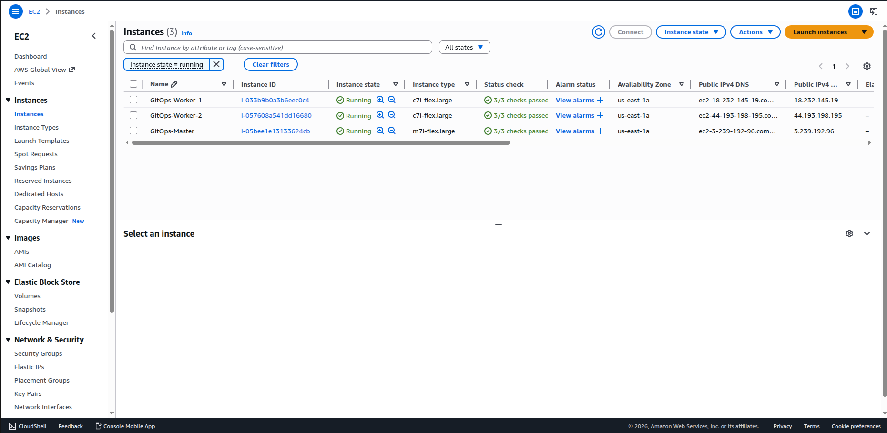

---

### Phase 2 — Cluster Configuration (Ansible)

Ansible manages the installation of Docker and Kubernetes (K3s), and facilitates node joining.

1. **Inventory Configuration (`hosts.ini`):** Update placeholders with the recorded IPs.
```ini
[master]
master_node ansible_host=<MASTER_IP>

[workers]
worker_1 ansible_host=<WORKER_1_IP>
worker_2 ansible_host=<WORKER_2_IP>

[all:vars]
ansible_user=ubuntu
ansible_ssh_private_key_file=~/.ssh/gitops_aws_key
```

2. **Disable Host Key Checking (`ansible.cfg`):**
```ini
[defaults]
host_key_checking = False
```

3. **Playbook Execution:**
```bash
cd ansible/
ansible-playbook -i hosts.ini setup.yaml
```

**Cluster Verification:** Access the Master node via SSH and execute `sudo kubectl get nodes`. All nodes should report a `Ready` status.

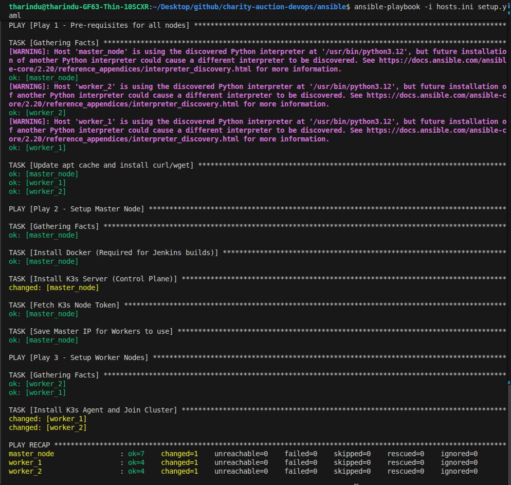
---
**Instance status by SSH:**

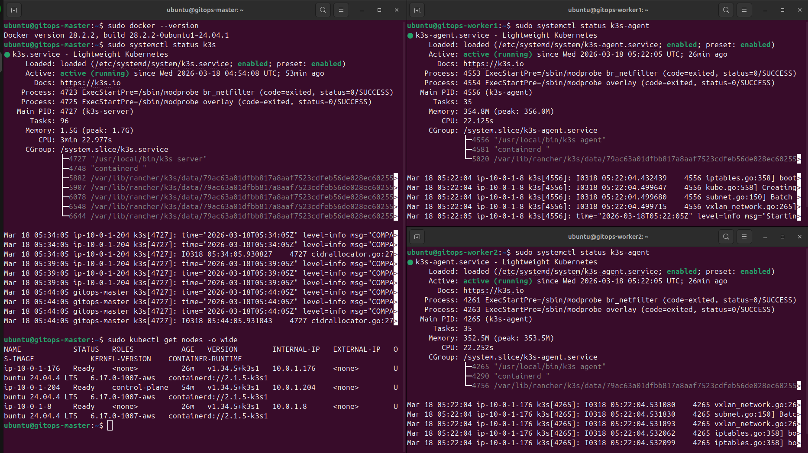
---
### Phase 3 — GitOps Repository Strategy

This phase establishes the separation of application source code from infrastructure manifests.

1. **Dockerfile Optimization (Repo A):**
   - **Backend:** Implements a multi-stage build for the Spring Boot application.
   - **Frontend:** Implements a standalone build for the Next.js application.
   *(Refer to the [Phase 3 Guide](Phase%203_GitOps%20Strategy.md) for full implementation details)*

2. **Manifest Repository Setup (Repo B):**
   - Initialize [`charity-auction-gitops-manifests`](https://github.com/tharindudeshapriya/charity-auction-gitops-manifests.git) on GitHub.
   - Include the following configuration files:
     - `mysql-statefulset.yaml`: Database configuration with persistent storage.
     - `backend-deployment.yaml`: Spring Boot application deployment.
     - `frontend-deployment.yaml`: Next.js application deployment.
     - `main-ingress.yaml`: Traefik ingress routing protocols.

---

### Phase 4 — Jenkins CI Implementation

Jenkins is responsible for the automated build and push processes.

1. **Jenkins Installation on Master Node:**
```bash
sudo docker run -u root -d \
  --name jenkins --restart always --memory="2g" \
  -p 8081:8080 \
  -v /var/run/docker.sock:/var/run/docker.sock \
  -v jenkins_home:/var/jenkins_home \
  jenkins/jenkins:lts

# Install Docker CLI within the Jenkins container
sudo docker exec -u root jenkins apt-get update
sudo docker exec -u root jenkins apt-get install -y docker.io
```

2. **Jenkins Web Interface Configuration (`http://<MASTER_IP>:8081`):**
   - **Authentication:** Retrieve the initial password via `sudo docker exec jenkins cat /var/jenkins_home/secrets/initialAdminPassword`.
   - **Required Plugins:** Install `Docker`, `Docker Pipeline`, and `Pipeline: GitHub Groovy Libraries`.
   - **Credential Management:**
     - `docker-hub-creds`: Configure Docker Hub ID and Access Token.
     - `github-token`: Configure GitHub ID and Personal Access Token.

3. **Pipeline Definition (`Jenkinsfile`):** Located in Repo A, this file defines the integration stages (Build, Push, and Manifest Update).

4. **Webhook Integration:** In Repo A Settings, configure a payload URL: `http://<MASTER_IP>:8081/github-webhook/`.

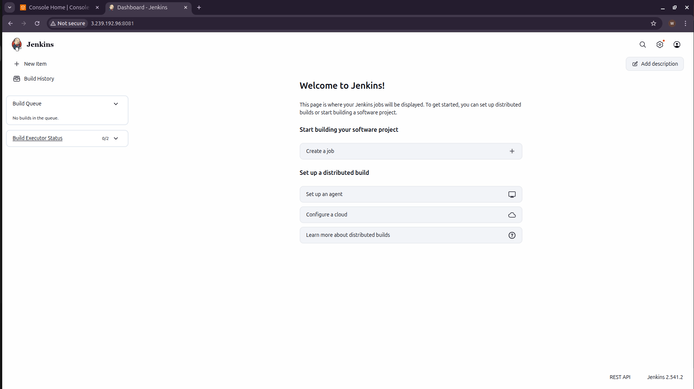
---

### Phase 5 — ArgoCD CD Implementation

ArgoCD maintains synchronization between the cluster state and the manifests in Repo B.

1. **ArgoCD Installation:**
```bash
sudo kubectl create namespace argocd
sudo kubectl apply -n argocd --server-side --force-conflicts \
  -f https://raw.githubusercontent.com/argoproj/argo-cd/stable/manifests/install.yaml
```

2. **Access and Authentication:**
   - **Expose Service:** Modify service type to NodePort: `sudo kubectl patch svc argocd-server -n argocd -p '{"spec": {"type": "NodePort"}}'`.
   - **Retrieve Credentials:** Execute `sudo kubectl -n argocd get secret argocd-initial-admin-secret -o jsonpath="{.data.password}" | base64 -d; echo`.

   **Step 1 — Find the Assigned Port:**
   ```bash
   sudo kubectl get svc argocd-server -n argocd
   ```
   Locate the port mapped to `443`. The output will contain an entry such as `443:3xxxx/TCP`. For example, if it reads `443:30326`, the ArgoCD UI is accessible on port `30326`.

   **Step 2 — Open the AWS Firewall (Security Group):**

   Because Kubernetes assigns a random high port, AWS will block the connection by default. To authorise access:

   1. Log into the **AWS Console** and navigate to **EC2 → Security Groups**.
   2. Locate the Security Group named **`gitops-cluster-sg`** and select it.
   3. Click **Edit inbound rules → Add rule** and configure the following:

   | Field | Value |
   |---|---|
   | Type | Custom TCP |
   | Port range | `30326` *(or the port identified in Step 1)* |
   | Source | `0.0.0.0/0` (Anywhere-IPv4) |

   4. Click **Save rules**.

**ArgoCD Web Interface:**

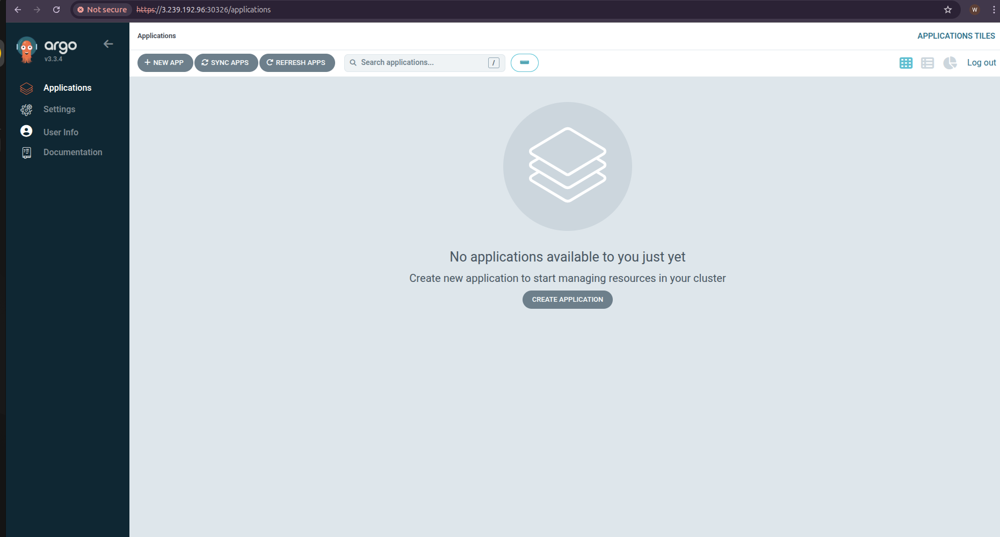

3. **Application Deployment:**
   - Integrate Repo B within ArgoCD Repository Settings.
   - Configure a new application with an `Automatic` synchronization policy.

---
**Jenkins Pipeline:**

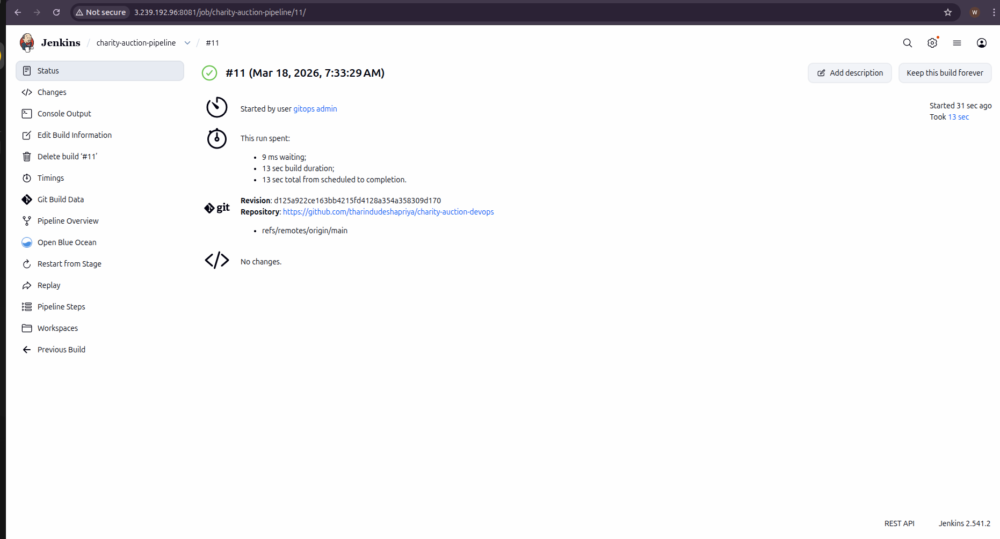

**ArgoCD Deployment:**

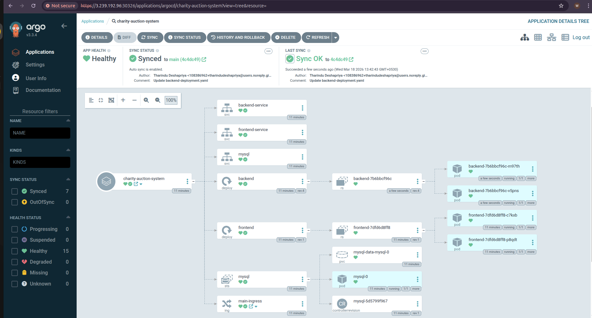

**Working Application:**

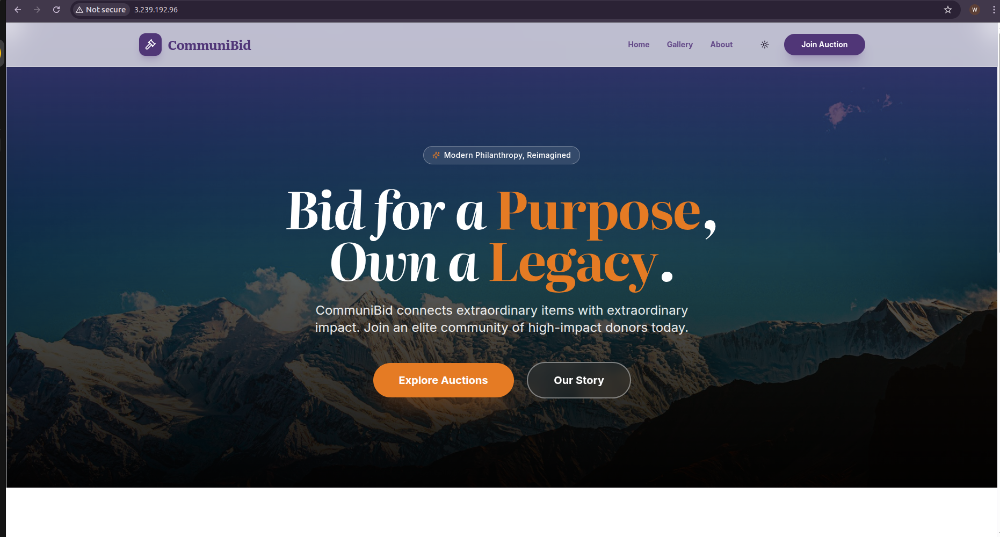

---

### Phase 6 — Observability and Monitoring

1. **Local Access Configuration:**
```bash
ssh -i ~/.ssh/gitops_aws_key ubuntu@<MASTER_IP> "sudo cat /etc/rancher/k3s/k3s.yaml" > ~/.kube/config
# Update ~/.kube/config to set the server address to <MASTER_IP>
```

2. **Monitoring Stack Installation (Helm):**
```bash
helm repo add prometheus-community https://prometheus-community.github.io/helm-charts
helm repo update
helm install monitoring prometheus-community/kube-prometheus-stack --namespace monitoring --create-namespace
```

3. **Grafana Access:**
   - **Authentication:** `kubectl --namespace monitoring get secrets monitoring-grafana -o jsonpath="{.data.admin-password}" | base64 -d; echo`
   - **Port Forwarding:** `kubectl port-forward svc/monitoring-grafana 8082:80 -n monitoring`

**Grafana Web Interface:**

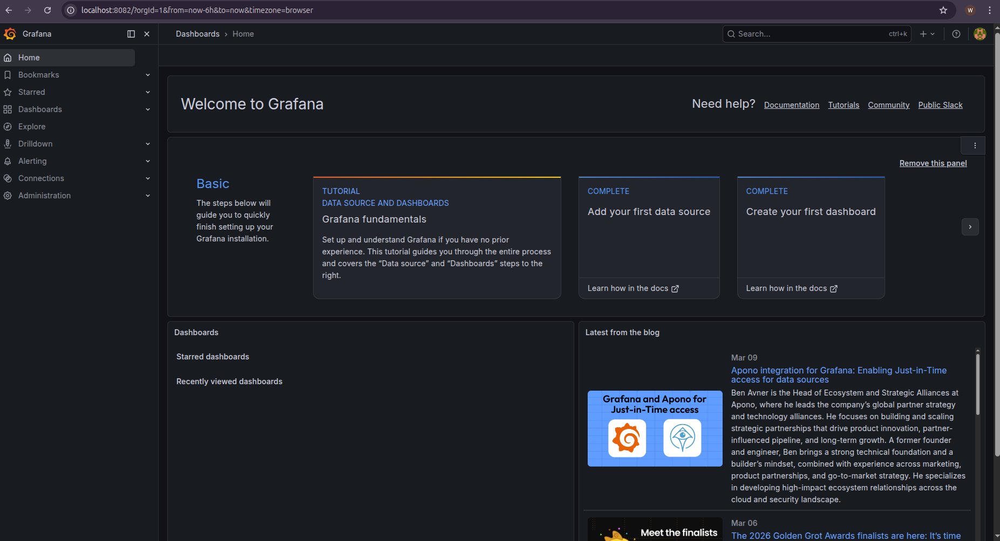

**Monitoring Dashboard:**

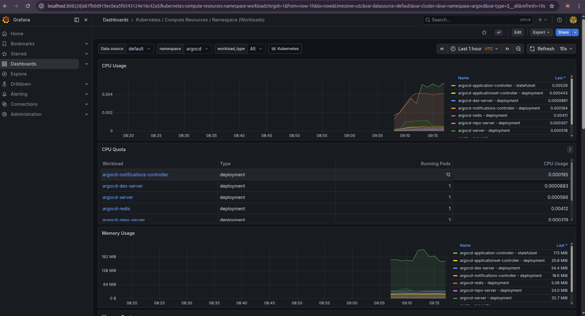


---

## Infrastructure Decommissioning

To prevent unnecessary AWS service charges, ensure all resources are destroyed upon completion:

```bash
cd terraform/
terraform destroy -auto-approve
```

---

## License

This project is intended for educational and portfolio purposes.
